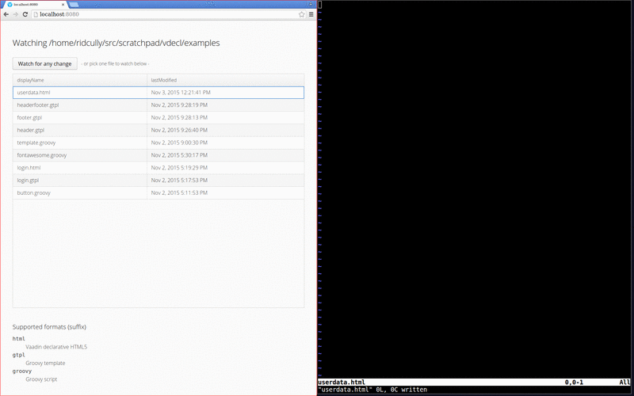

===========================================
Vaadin Declarative Design... for developers
===========================================

This tool is for developers, who want to write declarative UIs with instant
visual feedback.  A defined directory will be watched for file changes and the
last changed file will be attempted to render.

How to use
==========

Fetch this repo, and build it with ``./gradlew build``.  Then run it and set
the ``watch`` spring boot var to the directory, where your files are:

.. code:: shell

        WATCH=examples java -jar build/libs/vdecl.jar

Open your browser at http://localhost:8080.  You will see a list of all the
files in that directory.  Either select one file or click the button above the
list to watch for any change.

The ``examples`` directory contains some small examples to start with.  Open
one of the files in your favourite editor and make a change.  Your browser
refreshes with each change to any file in the configured directory and
displays it.

To watch for any change is great to work with multiple files (e.g. when using
includes in groovy templates).  Watching just one file gives you an URL you
can share with others.

Supported formats
=================

The following file types (by suffix) are supported:

html
 The classic declarative HTML5-ish structure directly supported by Vaadin.
 (`html example
 <https://github.com/christoph-frick/vdecl/blob/master/examples/userdata.html>`_)

gtpl
 This uses the Groovy MarkupTemplateEngine to render the file (without
 model).  It's a great way to mock data, since you can make use of the
 templating features to cut repetitive code.
 (`groovy template example
 <https://github.com/christoph-frick/vdecl/blob/master/examples/headerfooter.gtpl>`_)

groovy
 Just use plain old Groovy to write your UI.  A ``GroovyShell`` will pick that
 file type up and execute it.  It must return a ``Component``.
 (`groovy example
 <https://github.com/christoph-frick/vdecl/blob/master/examples/fontawesome.groovy>`_)

Why?
====

While the Designer for sure is nice, once you know all the components from
Vaadin by heart, clicking stuff together in a WYSIWYG editor is not every
developers dream.  Taking from awesome tools like ClojureScripts *Figwheel*,
that give the developer instantaneous feedback, providing a tool, that 

 - allows for quickly testing UIs or ideas

 - filling them with different mocked data (and keep them around for later)
   
 - or just eliminate tiresome reload round trips to tackle some "why is the
   Panel in that TabSheet not scrolling" problems

increases developer productivity.

License
=======

By: 3-clause BSD license

Copyright (c) 2015, Christoph Frick
All rights reserved.

Redistribution and use in source and binary forms, with or without
modification, are permitted provided that the following conditions are met:

* Redistributions of source code must retain the above copyright notice, this
  list of conditions and the following disclaimer.

* Redistributions in binary form must reproduce the above copyright notice,
  this list of conditions and the following disclaimer in the documentation
  and/or other materials provided with the distribution.

* Neither the name of vdecl nor the names of its
  contributors may be used to endorse or promote products derived from
  this software without specific prior written permission.

THIS SOFTWARE IS PROVIDED BY THE COPYRIGHT HOLDERS AND CONTRIBUTORS "AS IS"
AND ANY EXPRESS OR IMPLIED WARRANTIES, INCLUDING, BUT NOT LIMITED TO, THE
IMPLIED WARRANTIES OF MERCHANTABILITY AND FITNESS FOR A PARTICULAR PURPOSE ARE
DISCLAIMED. IN NO EVENT SHALL THE COPYRIGHT HOLDER OR CONTRIBUTORS BE LIABLE
FOR ANY DIRECT, INDIRECT, INCIDENTAL, SPECIAL, EXEMPLARY, OR CONSEQUENTIAL
DAMAGES (INCLUDING, BUT NOT LIMITED TO, PROCUREMENT OF SUBSTITUTE GOODS OR
SERVICES; LOSS OF USE, DATA, OR PROFITS; OR BUSINESS INTERRUPTION) HOWEVER
CAUSED AND ON ANY THEORY OF LIABILITY, WHETHER IN CONTRACT, STRICT LIABILITY,
OR TORT (INCLUDING NEGLIGENCE OR OTHERWISE) ARISING IN ANY WAY OUT OF THE USE
OF THIS SOFTWARE, EVEN IF ADVISED OF THE POSSIBILITY OF SUCH DAMAGE.
